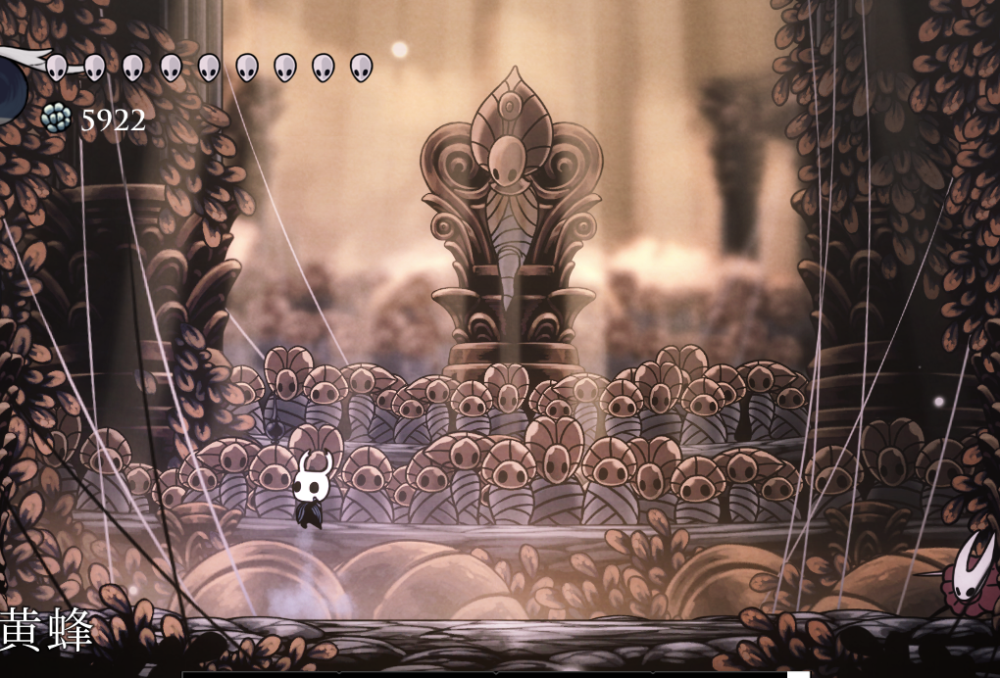
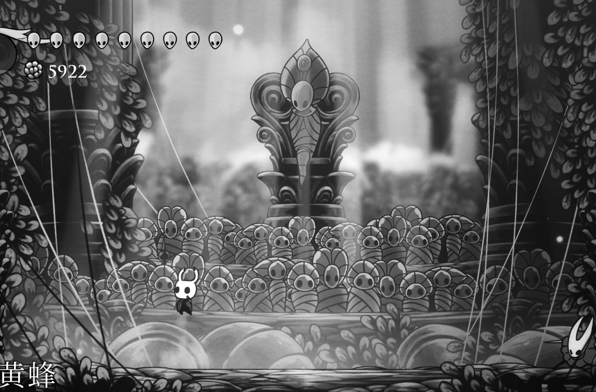
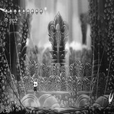

# Playing Hollow Knight with Deep Reinforcement Learning

This project is realized based on [https://github.com/seermer/HollowKnight_RL](https://github.com/seermer/HollowKnight_RL). You can see the details in README_OLD.md . If you also want to try to practice, you can follow the guidance of README_OLD.md to complete the basic configuration. 

I will refine this work from my understanding of the game and DRL.

## How to abstract the game environment

This is the most important part in my opinion. A game is not designed for AI training, but for human players. Therefore, it is very important to abstract an environment suitable for AI training, which is also the biggest difference from the general environment used in research experiments.

### What do we need an agent to learn?(goal)

I want the knight to win the different boss challenges.

### What can an agent do?(action)

Here we need to give the action set that may be used. I use **bold** for small sets of actions, non-bold for atomic actions.

* **MOVE**
  * LEFT: A
  * RIGHT: D
* ATTACK: J
* JUMP: SPACE
* DASH: K
* SKILL: F

On this basis, we can define richer actions.

* **MOVE**
  * LEFT: A
  * RIGHT: D
* **ATTACK**
  * BASIC: J
  * UP-ATTACK: W + J
  * DOWN-ATTACK: S + J
* **JUMP**
  * JUMP: SPACE (short or long)
  * DOUBLE-JUMP: SPACE + SPACE
* **SKILL**
  * DASH: K
  * SHOCKWAVE: F

Next is the frequency of interaction, which ensures the effectiveness of the action and indirectly affects the difficulty of learning. Here it is set to **0.2** seconds. Note that short jumps and long jumps are distinguished by time, so **0.5** seconds is set separately for long jumps here.

### What can an agent get?(observation)

Like a human player, I want the agent to get useful information from the pixels. 

This picture has been cropped on the basis of 1280X720, and some unnecessary information has been appropriately reduced. After loading the MOD that displays the BOSS HP bar, in the observe function, through the judgment of specific pixels, calculate the HP bar information of the knight and the BOSS.

Further, we obtain the grayscale image of the origin frame.

resize to 192X192

